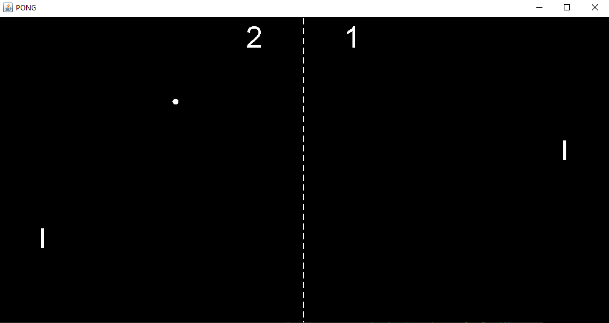

# Pong

This is a version of Pong I made using Java.
The goal was to make the gameplay as close to the original Atari gameplay as possible.

The paddles are controlled with 'w' and 's' for the left and up and down arrows for the right.
The space bar serves and escape can reset the round.

Version 2 added a splash screen to adjust all of the gameplay parameters, with the V1 settings as default.

Also the sound was removed; it was terrible.

